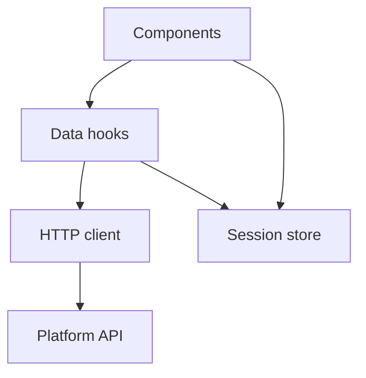

# Client

The browser client that talks to the platform.

## Architecture

Data fetching never happens in a component; it happens in a hook, so the component stays a pure
function of its props and the store.
